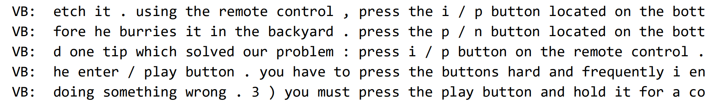
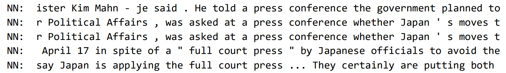

# POS Tagging

Like the NLTK intro [script](../NLTK_intro/), this script ([`POS_tagging.py`](./POS_tagging.py)) is terrific for familiarizing yourself with some of NLTK's basic methods. This script in particular emphasizes the pos tagging method (identifying parts of speech for words in a given text) and allows for analyzing the different environments/context in which specific tags appear. It also brings to light the effects certain words, specifically archaic or pseudo words, have on the tagger.

## Concordance Tables

We first look at two concordance tables for the word "press", generated from two separate corpora within NLTK. One is the `product_reviews_1` corpus and the other is the `reuters` (news stories) corpus. A sample of each of the concordance tables are presented below:

Product Reviews                                                  |  Reuters
:---------------------------------------------------------------:|:----------------------------------------------------:
                 |  

### The Analysis

Given the `product_reviews_1` and the `reuters` corpora, I suspected that the word/token "press" would predominantly be tagged as a verb within the `product_reviews_1` corpus and a noun within the `reuters` corpus. This was based on the idea that product reviews might refer to "press" more often as an instruction (e.g. press the button), and that the news might refer to "press" more often as the entity for cultivating news. The resulting concordance tables for each corpus confirms my suspicions: "press" is more frequently a verb in the `product_reviews_1` corpus and more frequently a noun in the `reuters` corpus.

## Tagging Accuracy

Next, we look at the accuracy of NLTK's POS tagger. We use Lewis Carroll's [Jabberwocky](https://www.poetryfoundation.org/poems/42916/jabberwocky) as the text to be tagged as it provides speculation on the tagging of gibberish: will the tagger correctly identify these words, or will it struggle? A sample of the output (i.e. each word followed by its tag) is provided below on the left. Below on the right, is the same sample with corrected tags (slightly subject to opinion).

|Automatic Tags                                                   |  Corrected Tags
:-----------------------------------------------------------------|:----------------------------------------------------|
|JABBERWOCKY NNP ‘Twas NNP brillig NN , , and CC the DT slithy JJ toves NNS Did NNP gyre NN and CC gimble JJ in IN the DT wabe NN                                                 | JABBERWOCKY NNP ‘Twas VBD brillig NN , , and CC the DT slithy JJ toves NNS Did VBD gyre VB and CC gimble VB in IN the DT wabe NN                           |

Since the manually corrected tags are slightly subject to opinion, the actual accuracy of the tagger might differ from interpretation to interpretation. Based on my manual tagging (the full text with the corrected tags are not available), the accuracy of the tagger, or the number of correct tags divided by the total number of tags was 167/206 or 81%.

### The Analysis

Given that the tagger tagged several of the nonsense words incorrectly, it clearly doesn’t do so well on words it doesn’t know. This has mostly to do with these particular words being novel to the tagger. They weren’t included in the training data, so the tagger doesn't have much to rely on. It can really only pick out salient characteristics of the spelling, which could indicate distinguishable morphemes, such as the plural "s" of nouns. It can’t even rely on context of the surrounding words and tags because the words rather than the sentences are being tagged individually. One can speculate that even if these nonsense words were real words in English (maybe archaic or of low frequency), the tagger still wouldn’t perform any differently because they most likely wouldn’t have appeared in the training data. What’s included in the training data is key.
