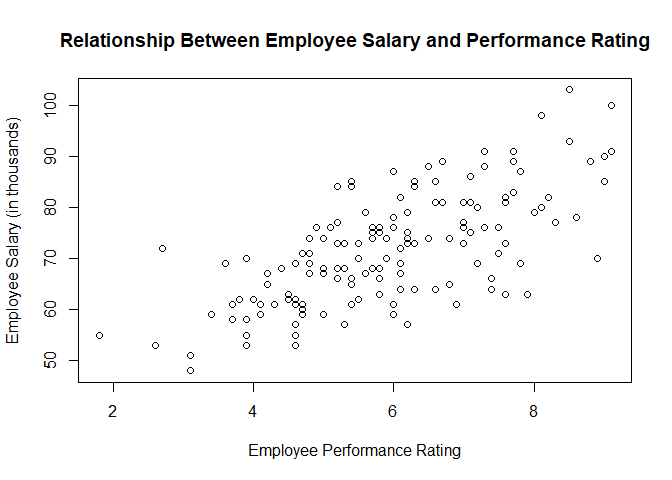
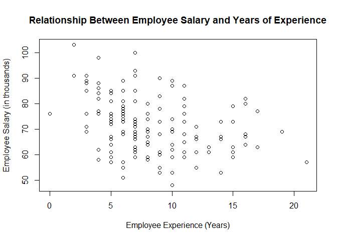
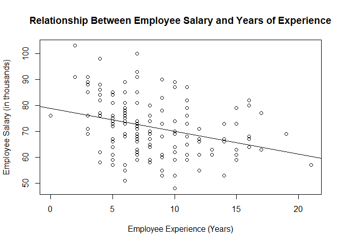
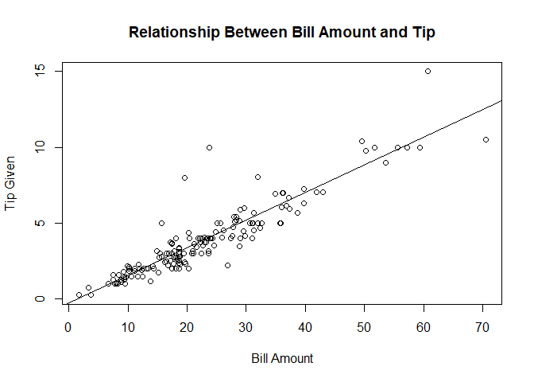

# Linear Regression Basics

This document provides an intro to linear regression of sorts (not exhaustive). It instructs you how to conduct regression analysis to determine, depending on the data set, whether a linear relationship exists between a selected predictor variable and the outcome variable. It also serves as a refresher for various methods/calculations.

The regression analyses (and the calculation of relevant statistics) throughout this document are predominantly carried out through R functions; however, the implemenation of some equations (long hand) are involved (bare formulas aren't provided).

Here we cover multiple points of analysis:

  * Plotting
  * Identifying a model
      * Getting the coefficients
      * Interpreting the model
  * Running t-tests and getting p-values
  * Making model predictions
  * Obtaining/calculating relevant statistics
      * residual sum of squares
      * 95% prediction intervals
      * 95% confidence intervals


## Getting Started

Read in the data set `manager.csv` which contains information on employee rating, years of experience, salary, and origin (internal, external). These data are relevant to P1 - P13.


```r
manager_data <- read.csv("data/manager.csv", header = TRUE, as.is = TRUE, fileEncoding="UTF-8-BOM")
colnames(manager_data) <- c("rating", "salary", "experience", "origin")
head(manager_data)
```

```
##   rating salary experience   origin
## 1    8.5     93          7 External
## 2    4.1     59         10 Internal
## 3    5.8     75          6 External
## 4    4.8     69          8 External
## 5    8.3     77         17 Internal
## 6    7.0     76          5 Internal
```

Read in the data set `restauranttips.csv` which contains information on bill amount, tip amount, whether the bill was paid by cash (n) or credit card (y), server, percent tip, and day of the week. These data are relevant to P14.


```r
restaurant_data <- read.csv("data/restauranttips.csv", header = TRUE, as.is = TRUE, fileEncoding="UTF-8-BOM")
head(restaurant_data)
```

```
##    Bill   Tip Credit Guests Day Server PctTip
## 1 23.70 10.00      n      2   f      A   42.2
## 2 36.11  7.00      n      3   f      B   19.4
## 3 31.99  5.01      y      2   f      A   15.7
## 4 17.39  3.61      y      2   f      B   20.8
## 5 15.41  3.00      n      2   f      B   19.5
## 6 18.62  2.50      n      2   f      A   13.4
```

## Problems

<b>P1:</b>&nbsp; Using the `manager.csv` data set, determine whether rating or experience are predictive of salary. Discuss whether linear regression is plausible.

* Rating and Salary


  ```r
  plot(manager_data$rating, manager_data$salary, xlab = "Employee Performance Rating", ylab = "Employee Salary (in thousands)", main = "Relationship Between Employee Salary and Performance Rating")
  ```

  <div align="center">

  

  </div>

  There is the assumption that an employee with a higher rating would have a higher salary than an employee with a lower rating, which could imply some sort of relationship between the two variables. From a purely data driven perspective, a linear regression seems highly plausible, affirming this assumption, because the scatterplot indicates a relatively strong positive linear trend between employee rating and salary.

* Experience and Salary


  ```r
  plot(manager_data$experience, manager_data$salary, xlab = "Employee Experience (Years)", ylab = "Employee Salary (in thousands)", main = "Relationship Between Employee Salary and Years of Experience")
  ```

  <div align="center">

  

  </div>

  Although there is a negative linear(ish) trend between employee experience and salary, linear regression seems less plausible in this situation than in the previous situation.

<b>P2:</b>&nbsp; Fit a linear regression model with salary (outcome) and years of experience (predictor). Interpret the slope coefficient.


  ```r
  plot(manager_data$experience, manager_data$salary, xlab = "Employee Experience (Years)", ylab = "Employee Salary (in thousands)", main = "Relationship Between Employee Salary and Years of Experience")

  model_experience <- lm(salary ~ experience, manager_data)
  abline(model_experience)
  ```

  <div align="center">

  

  </div>

  ```r
  model_experience$coefficients
  ```

  ```
  ## (Intercept)  experience
  ##  78.7796302  -0.8779235
  ```

<div align="center">

Regression model: &nbsp;&nbsp;&nbsp; 

</div>

 <b>Slope interpretation:</b>	For every additional year of experience, it’s expected that an employee’s salary will decrease by 0.878 dollars (in thousands) or $878 roughly.

 Given that this is contradictory to what is expected, it suggests that the relationship between these two variables is suspect. Further investigation is needed.

<b>P3:</b>&nbsp; Estimate the average salary of employees with 5 years of experience. Estimate the difference between the average salary of employees with 15 years of experience and employees with 5 years of experience.

* How-to with R


  ```r
  salary_5yrs <- predict(model_experience, data.frame(experience = 5))
  salary_15yrs <- predict(model_experience, data.frame(experience = 15))
  ```

      salary_5yrs: 74.39001 or $74,390
      salary_15yrs: 65.61078 or $65,610

  


  ```r
  salary_diff <- salary_5yrs - salary_15yrs
  ```

      salary_diff: 8.779235 or $8,779


* How-to with equation

  

  

  Difference: &nbsp;&nbsp;&nbsp; $74,390 - $65,610 = $8,780

<b>P4:</b>&nbsp; Estimate the difference in salary between 2 randomly chosen employees, one who has 7 years of experience and one who has 17 years of experience. Comment on the results.

Given that the difference in years of experience (10 years) is the same as that in the previous problem, we can expect the difference in salary to be identical. Proof:


```r
salary_7yrs <- predict(model_experience, data.frame(experience = 7))
salary_17yrs <- predict(model_experience, data.frame(experience = 17))
```

    salary_7yrs: 72.63417 or $72,634
    salary_17yrs: 63.85493 or $63,855


</br>


```r
salary_diff <- salary_7yrs - salary_17yrs
```

    salary_diff: 8.779235 or $8,779


However, we have to remember that these estimates represent specific salaries (of two random employees) rather than the average salaries of all those who have 7 or 17 years of experience, respectively. This distinction has direct effects on the amount of variance present. So, although the difference-in-salaries estimates are identical, the variances differ. Specifically, the variance of the estimate in this scenario is greater than that of the previous scenario.

<b>P5:</b>&nbsp; Analyze the relationship between performance rating and salary. Obtain the least squares line and interpret the slope.


```r
plot(manager_data$rating, manager_data$salary, xlab = "Employee Performance Rating", ylab = "Employee Salary (in thousands)", main = "Relationship Between Employee Salary and Performance Rating")

model_rating <- lm(salary ~ rating, manager_data)
abline(model_rating)
```

<div align="center">


</div>

```r
model_rating$coefficients
```

```
## (Intercept)      rating
##   42.575039    4.924578
```

<div align="center">

Regression model: &nbsp;&nbsp;&nbsp; 

</div>

<b>Slope interpretation:</b>	For every additional point increase in performance rating, an employee's salary is expected to increase by 4.925 dollars (in thousands) or $4,925 roughly.

<b>P6:</b>&nbsp; Compare the average salary of an employee with a rating of 3 to that of an employee with a rating of 6. What do you conclude?

* With R


  ```r
  salary_3rat <- predict(model_rating, data.frame(rating = 3))
  salary_6rat <- predict(model_rating, data.frame(rating = 6))
  ```

      salary_3rat: 57.34877 or $57,349
      salary_6rat: 72.12251 or $72,123

  


  ```r
  salary_diff <- salary_6rat - salary_3rat
  ```

      salary_diff: 14.77373 or $14,774


* With equation

  

  

  Difference: &nbsp;&nbsp; $72,125 - $57,350 = $14,775

An employee with a performance rating of 3 would be estimated to have a salary of $57,350 and an employee with a performance rating of 6 would be estimated to have a salary of $72,125, so the estimated salary difference between those two employees would be $14,775. Based on this difference, we can conclude that a person with a higher rating would have a higher salary.

<b>P7:</b>&nbsp; Using the regression in the previous problem, calculate the residual sum of squares. Recalculate the residuals for this data when the intercept is set to 40 and the slope is set to 5.5. Compare the result to the residual sum of squares for the least squares estimates.

* Residual sum of squares of initial regression


  ```r
  anova(model_rating)
  ```

  ```
  ## Analysis of Variance Table
  ##
  ## Response: salary
  ##            Df Sum Sq Mean Sq F value    Pr(>F)    
  ## rating      1 7978.5  7978.5  129.87 < 2.2e-16 ***
  ## Residuals 148 9092.3    61.4                      
  ## ---
  ## Signif. codes:  0 '***' 0.001 '**' 0.01 '*' 0.05 '.' 0.1 ' ' 1
  ```

      Residual sum of squares: 9092.3


* Residual sum of squares of altered regression


  ```r
  new_residuals <- manager_data$salary - (40 + manager_data$rating * 5.5)
  SSE <- sum(new_residuals^2)
  ```

      Residual sum of squares: 9302.218

The residual sum of squares for the original regression model (9092.3) is smaller than the residual sum of squares for the same data with altered coefficients (9302.218). This is intuitive because the original regression with the least square estimates makes it so that all the data points are as close as they can be to the regression line. In other words, the residuals for each of the data points are minimized. With the altered slope and intercept this is not the case, making the residual sum of squares larger.

<b>P8:</b>&nbsp; Using the regression in the previous problem, what would your response be to someone who asked you to predict the salary of an employee with a rating of 10?


```r
salary_10rat <- predict(model_rating, data.frame(rating = 10))
```

    salary_10rat: 91.82082 or $91,821


However, given that this particular rating is of a value outside the scope of the data, we have to be careful. Extrapolating can be unreliable.

<b>P9:</b>&nbsp; Obtain the t-test for the hypothesis  from the regression of salary on years of experience. Provide the test-statistic, the p-value, and a conclusion in context. Does the result help to explain the negative slope?

<div align="center">

Regression model: &nbsp;&nbsp;&nbsp; 

</div>

* With R


  ```r
  summary(model_experience)
  ```

  ```
  ##
  ## Call:
  ## lm(formula = salary ~ experience, data = manager_data)
  ##
  ## Residuals:
  ##     Min      1Q  Median      3Q     Max
  ## -22.512  -6.628  -0.390   6.702  27.366
  ##
  ## Coefficients:
  ##             Estimate Std. Error t value Pr(>|t|)    
  ## (Intercept)  78.7796     1.9118  41.207  < 2e-16 ***
  ## experience   -0.8779     0.2116  -4.149  5.6e-05 ***
  ## ---
  ## Signif. codes:  0 '***' 0.001 '**' 0.01 '*' 0.05 '.' 0.1 ' ' 1
  ##
  ## Residual standard error: 10.16 on 148 degrees of freedom
  ## Multiple R-squared:  0.1042,	Adjusted R-squared:  0.09816
  ## F-statistic: 17.22 on 1 and 148 DF,  p-value: 5.602e-05
  ```

      test-statisitic: -4.149
      p-value: 5.6e-0.5


* With equations (values also found in `summary()`)

  test-statistic: &nbsp;&nbsp;&nbsp; 

  p-value: &nbsp;&nbsp;&nbsp; 

Given the slope’s test-statistic of -4.149 and a corresponding p-value of 5.6e-05, which is less than , we can reject the null hypothesis . It can be concluded that the experience an employee has is a significant predictor of their salary. That being said, I don’t think this result effectively explains the negative slope. It would make sense for years of experience to predict salary, but I would think more so in the positive direction.

<b>P10:</b>&nbsp; Obtain the t-test of the hypothesis  where  is the slope for the regression of salary on employee rating. Provide the test-statistic, the p-value, and a conclusion in context.

<div align="center">

Regression model: &nbsp;&nbsp;&nbsp; 

</div>

* With R


  ```r
  summary(model_rating)
  ```

  ```
  ##
  ## Call:
  ## lm(formula = salary ~ rating, data = manager_data)
  ##
  ## Residuals:
  ##      Min       1Q   Median       3Q      Max
  ## -18.4792  -4.5974  -0.1979   4.8511  18.5660
  ##
  ## Coefficients:
  ##             Estimate Std. Error t value Pr(>|t|)    
  ## (Intercept)  42.5750     2.6289    16.2   <2e-16 ***
  ## rating        4.9246     0.4321    11.4   <2e-16 ***
  ## ---
  ## Signif. codes:  0 '***' 0.001 '**' 0.01 '*' 0.05 '.' 0.1 ' ' 1
  ##
  ## Residual standard error: 7.838 on 148 degrees of freedom
  ## Multiple R-squared:  0.4674,	Adjusted R-squared:  0.4638
  ## F-statistic: 129.9 on 1 and 148 DF,  p-value: < 2.2e-16
  ```

  The summary function for the regression model returns the test-statistic and p-value for each of the coefficients based on their differentiation from 0. These values result from a two-sided t-test. However, our alternative hypothesis is directional, so we need a one sided t-test. For this, the t-value would remain the same, but the p value would essentially be cut in half. Because the p-value for the two-sided test is so small, R caps it. So, we have to implement the pt() function:


  ```r
  pt(11.4, df = 149, lower.tail = FALSE)
  ```

      test-statistic: 11.4
      p-value: 2.430632e-22


* With equations (values also found in `summmary()`)

  test-statistic: &nbsp;&nbsp;&nbsp; 

  p-value: &nbsp;&nbsp;&nbsp; 

Given the slope’s test-statistic of 11.4 and a corresponding p-value of 2.43e-22, which is drastically less than , we can reject the null hypothesis . The slope coefficient for an employee’s performance rating is greater than 0.

<b>P11:</b>&nbsp; For the regression of salary on employee rating, find the average salary for employees who have a rating of 3.5 and compare that to the average salary for those who have a rating of 8.5. For both ratings, find the 95% confidence interval. Do the intervals overlap?


```r
predict(model_rating, data.frame(rating = c(3.5, 8.5)), int = "c", level = 0.95)
```

```
##        fit      lwr      upr
## 1 59.81106 57.40232 62.21980
## 2 84.43395 81.87928 86.98863
```

    Average salary for employees that have a performance rating of 3.5: $59,811
    Confidence interval: (57.402, 62.220) -> between $57,402 and $62,220

    Average salary for employees that have a performance rating of 8.5: $84,434
    Confidence interval: (81.879, 86.989) -> between $81,879 and $86,989


The intervals do not overlap.

The difference between average salaries:

$84,434 - $59,811 = $24,623

is the same as the slope 4.925 multiplied by 5, the difference between the two ratings (8.5 - 3.5).

<b>P12:</b>&nbsp; For the regression of salary on employee rating, find the average salary for employees who have a rating of 2.5 and compare that to the average salary for those who have a rating of 8.4. For both ratings, find the 95% prediction interval. Show work through relevant formulas, but obtain the necessary measures through R.

* Performance rating of 2.5

  Predicted salary: &nbsp;&nbsp;&nbsp; 

  Predicted interval: &nbsp;&nbsp;&nbsp; 

  Relevant statistics from R:


  ```r
  xbar <- mean(manager_data$rating)
  critical_t <- qt(0.975, 148)
  Sxx <- sum((manager_data$rating - xbar)^2)
  n <- nrow(manager_data)

  anova(model_rating)
  ```

  ```
  ## Analysis of Variance Table
  ##
  ## Response: salary
  ##            Df Sum Sq Mean Sq F value    Pr(>F)    
  ## rating      1 7978.5  7978.5  129.87 < 2.2e-16 ***
  ## Residuals 148 9092.3    61.4                      
  ## ---
  ## Signif. codes:  0 '***' 0.001 '**' 0.01 '*' 0.05 '.' 0.1 ' ' 1
  ```

  * &nbsp;:&nbsp;&nbsp;&nbsp;&nbsp;&nbsp;&nbsp;&nbsp;&nbsp; `5.900667`
  * &nbsp;:&nbsp;&nbsp;&nbsp;&nbsp;&nbsp;&nbsp;&nbsp;&nbsp;&nbsp; `1.976122`
  * &nbsp;:&nbsp;&nbsp;&nbsp; `328.9899`
  * &nbsp;: `61.4`
  * &nbsp;:&nbsp;&nbsp;&nbsp;&nbsp;&nbsp;&nbsp;&nbsp;&nbsp; `150`

<div align="center">


</div>

* Perfomance rating of 8.4

  Predicted salary: &nbsp;&nbsp;&nbsp; 

  Predicted interval: &nbsp;&nbsp;&nbsp; 

  Relevant statistics from R:

  * &nbsp;:&nbsp;&nbsp;&nbsp;&nbsp;&nbsp;&nbsp;&nbsp;&nbsp; `5.900667`
  * &nbsp;:&nbsp;&nbsp;&nbsp;&nbsp;&nbsp;&nbsp;&nbsp;&nbsp;&nbsp; `1.976122`
  * &nbsp;:&nbsp;&nbsp;&nbsp; `328.9899`
  * &nbsp;: `61.4`
  * &nbsp;:&nbsp;&nbsp;&nbsp;&nbsp;&nbsp;&nbsp;&nbsp;&nbsp; `150`

<div align="center">


</div>

<b>Direct prediction interval code (values differ slightly from equations):</b>


```r
predict(model_rating, data.frame(rating = c(2.5, 8.4)), int="p", level = 0.95)
```

```
##        fit      lwr      upr
## 1 54.88648 39.07703 70.69594
## 2 83.94150 68.25516 99.62783
```

<b>P13:</b>&nbsp; The average employee performance rating is approximately 5.9. Without using the regression to calculate the mean salary of those whose rating is average, find out what the average salary is based on the usual sample statistics of mean and standard deviations of the data. Justify your answer using facts about the regression line and points on that line.


```r
salary_avgrat <- mean(manager_data$salary)
```

    salary_avgrat: 71.63333 or $71,6333


To find the average salary of those whose rating is average, we can simply find the average salary (overall). This stems from the fact that , suggesting that  is on the regression line.

<b>P14:</b>&nbsp; For the `restauranttips.csv` data set, carry out a regression analysis for tip amount  on the amount of the bill . Present a relevant graph, find the regression line, and carry out a t-test to assess whether there is a linear relationship between bill and tip amount. Find a confidence interval for the slope parameter . Predict the average tip for a $40 bill. Find the confidence interval for a $40 bill.

* Plot


  ```r
  plot(restaurant_data$Bill, restaurant_data$Tip, xlab = "Bill Amount", ylab = "Tip Given", main = "Relationship Between Bill Amount and Tip")

  model_tip <- lm(Tip ~ Bill, restaurant_data)
  abline(model_tip)
  ```

  <div align="center">

  

  </div>

* Regression information: t-test and p-value

  <div align="center">

  

  </div>


    ```r
    summary(model_tip)
    ```

    ```
    ##
    ## Call:
    ## lm(formula = Tip ~ Bill, data = restaurant_data)
    ##
    ## Residuals:
    ##     Min      1Q  Median      3Q     Max
    ## -2.3911 -0.4891 -0.1108  0.2839  5.9738
    ##
    ## Coefficients:
    ##              Estimate Std. Error t value Pr(>|t|)    
    ## (Intercept) -0.292267   0.166160  -1.759   0.0806 .  
    ## Bill         0.182215   0.006451  28.247   <2e-16 ***
    ## ---
    ## Signif. codes:  0 '***' 0.001 '**' 0.01 '*' 0.05 '.' 0.1 ' ' 1
    ##
    ## Residual standard error: 0.9795 on 155 degrees of freedom
    ## Multiple R-squared:  0.8373,	Adjusted R-squared:  0.8363
    ## F-statistic: 797.9 on 1 and 155 DF,  p-value: < 2.2e-16
    ```

  <div align="center">

  Regression model: &nbsp;&nbsp;&nbsp; 

  </div>


        test-statistic: 28.247
        p-value: <2e-16 ***


    Since the p-value for the slope (tip amount) is far less than , we can reject the null hypothesis . Therefore, there's strong indication that a linear relationship exists between the amount of the bill and the amount of the tip.

* Slope confidence interval


  ```r
  confint(model_tip, level = 0.95)
  ```

  ```
  ##                  2.5 %     97.5 %
  ## (Intercept) -0.6204983 0.03596335
  ## Bill         0.1694718 0.19495768
  ```

      CI: (0.169, 0.195)


* Estimated average tip and confidence interval for a $40 bill


  ```r
  predict(model_tip, data.frame(Bill = 40), int = "c", level = 0.95)
  ```

  ```
  ##        fit      lwr      upr
  ## 1 6.996322 6.727466 7.265178
  ```

      predicted tip = 6.996322 or $7.00.
      Confidence interval = (6.727, 7.265)
